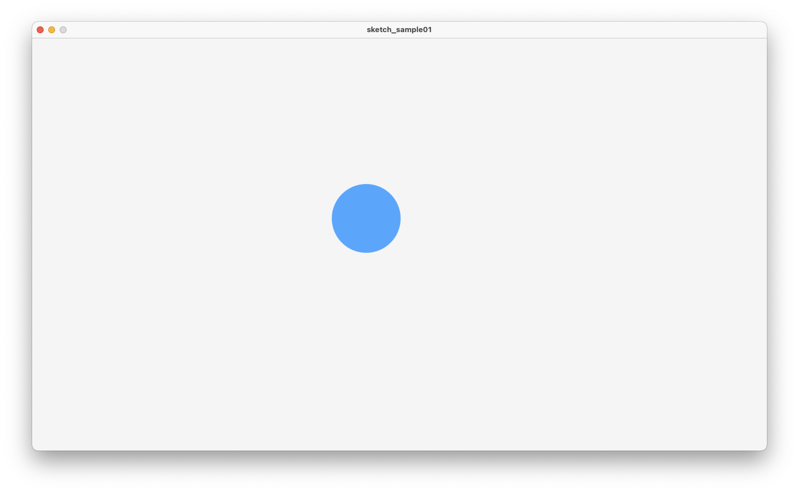
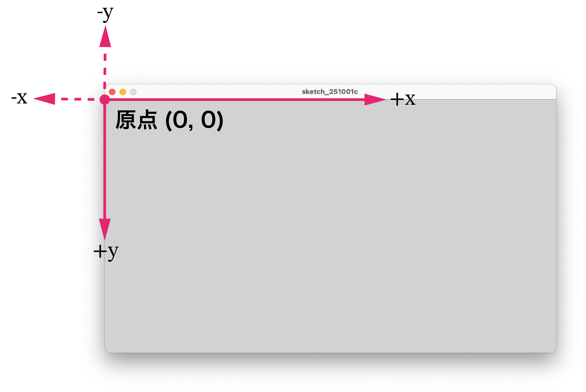
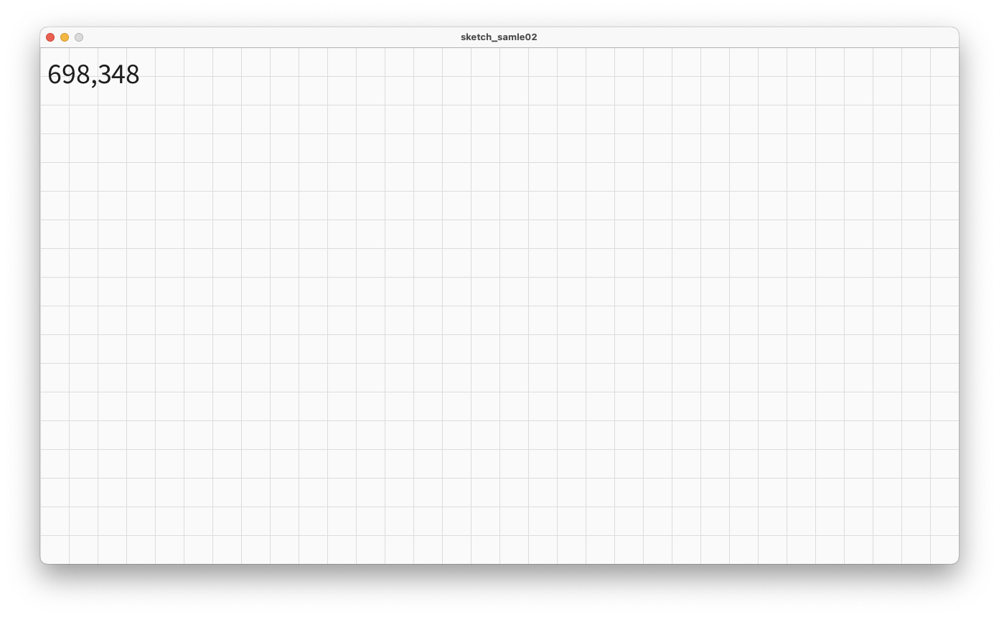
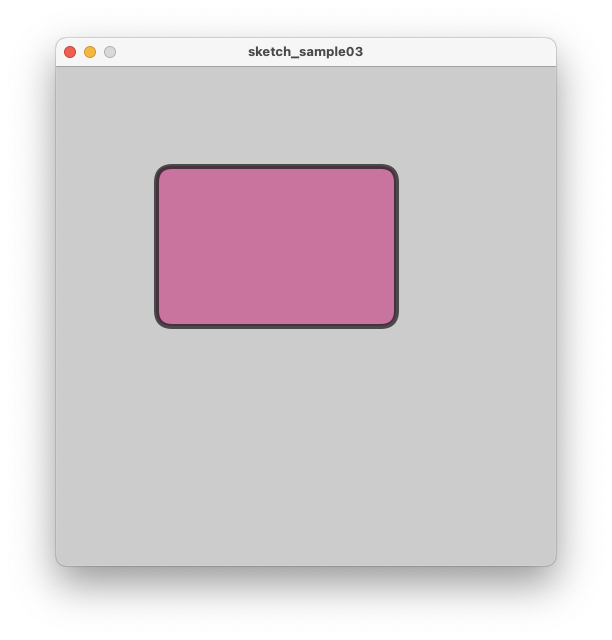
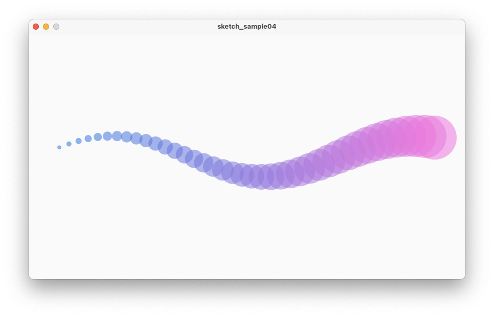
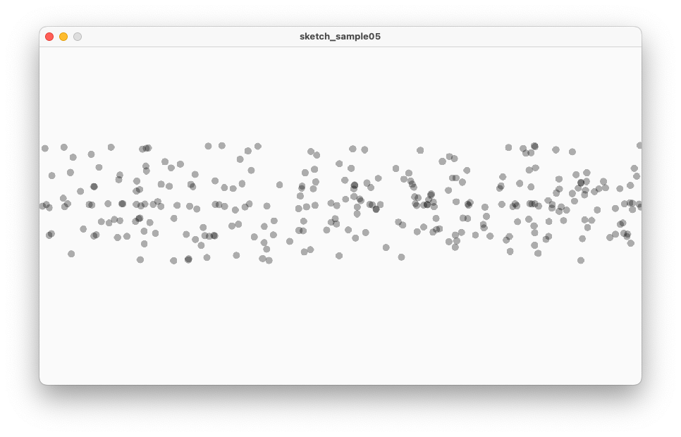
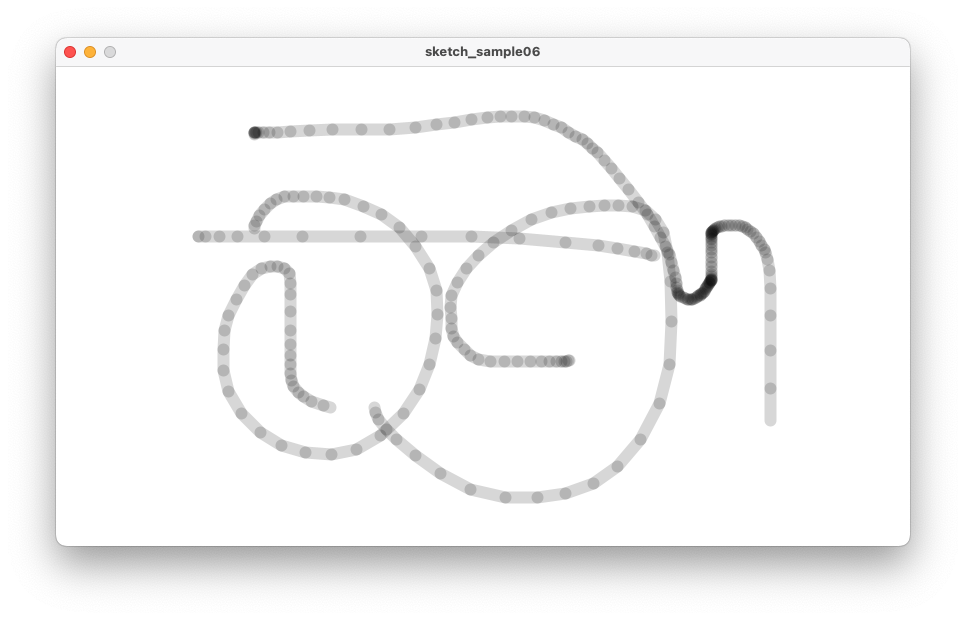
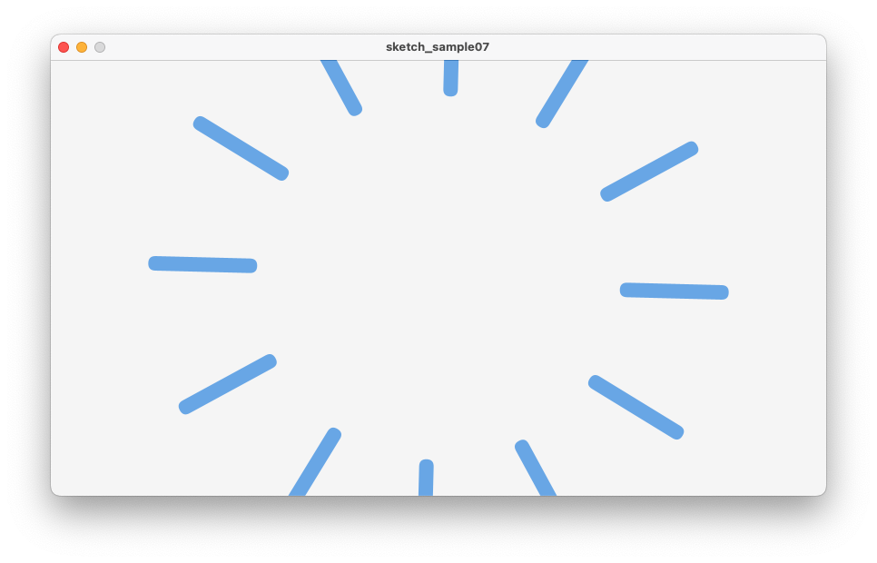

# 情報処理応用基礎
# 第2回：Processing入門と2D描画

清水 哲也 ( shimizu@info.shonan-it.ac.jp )

---

# 第2回：Processing入門と2D描画

* ねらい：Processingの基本文法と描画モデルを最短で把握し，**確実に動く2Dスケッチ**を作れるようにする．
* 環境：[Processing 4](https://processing.org/)
* 本日の成果物：
  * 最小テンプレ（setup/draw）
  * 2D図形・色・透明度のデモ
  * 反復・乱数・入力を使った**簡易ジェネラティブ作品**

---

# 4回の授業内容

1. **Processing入門と2D描画** ← 今日
2. 陰影（ライト）とテクスチャ（3D導入）
3. アニメーション／ベクトル／粒子（基礎）
4. 総合演習・発表（ミニ作品）

<!-- 評価（100点）：P1 15｜P2 20｜P3 25｜P4 40（README＋30–60秒動画必須）-->

---

# 今日のゴール

* `setup()` と `draw()` の役割を説明できる
* 2D座標系（原点・向き）と**描画順序**を理解する
* `stroke/fill/alpha` と基本図形を使い分けられる
* 反復（`for`）・乱数（`random()`）・入力（`mouseX`/`key`）を組み合わせられる

---

# Processingの描画モデル

* `setup()`：1回だけ実行（ウィンドウ設定・初期化）
* `draw()`：毎フレーム実行（アニメーションの本体）
* **重ね順**：先に描いたものが下，後に描いたものが上（レイヤー）

```processing
void setup(){
  size(1280,720); // 2D
  frameRate(60);
  noStroke();
}
void draw(){
  background(245);
  fill(0,120,255,160); // RGBA
  ellipse(mouseX, mouseY, 120, 120);
}
```

---

# Processingの描画モデル



---

# 2D座標系と描画領域

* 原点：`(0,0)` は左上，横軸：x軸，縦軸：y軸



---

# 2D座標系と描画

* ウィンドウ座標：`0 ≤ x < width`，`0 ≤ y < height`
* **座標の把握**→`text(mouseX+","+mouseY, 10, 20)` で可視化

```processing
void draw(){
  background(250);
  stroke(220);
  for(int x=0; x<width; x+=40) {
    line(x, 0, x, height);
  }
  for(int y=0; y<height; y+=40) {
    line(0, y, width, y);
  }
  fill(30);
  text(mouseX+","+mouseY, 10, 20);
}
```

---

# 2D座標系と描画



---

# 基本図形の関数

* 点・線：`point(x,y)`, `line(x1,y1,x2,y2)`
* 矩形：`rect(x,y,w,h)`（`rectMode(CENTER)` で中心基準）
* 円/楕円：`ellipse(x,y,w,h)`（`ellipseMode(CENTER)`）
* 多角形：`beginShape(); vertex(...); endShape(CLOSE);`
* 弧：`arc(x,y,w,h,a1,a2)`（角度はラジアン）

> 補足：角度は `radians(deg)` を使うと安全

---

# 色と透明度，線のスタイル

* 塗り：`fill(r,g,b[,a])`｜枠線：`stroke(r,g,b[,a])`
* 塗りなし：`noFill()`｜枠線なし：`noStroke()`
* 線幅：`strokeWeight(px)`
* カラーモード：`colorMode(RGB,255)`（既定）/ `colorMode(HSB,360,100,100)`

```processing
size(500, 500);
color c1 = color(200,80,140); // 色情報を保存するcolor変数
strokeWeight(5);
fill(c1, 180);
stroke(20, 180);
rect(100, 100, 240, 160, 16);
```

---

# 色と透明度，線のスタイル



---

# 反復（for）でパターンを作る

```processing
void setup(){
  size(854,480);
}

void draw(){
  background(250);
  noStroke();
  for(int i=0; i<40; i++){
    float x = map(i, 0, 39, 60, width-60);
    float s = 8 + i*2;
    fill(40+5*i, 120, 220, 140);
    ellipse(x, height*0.5 + sin(frameCount*0.02+i*0.2)*40, s, s);
  }
}
```

* `map()`：区間変換, `sin()`：周期性の簡単な動き

---

# 反復（for）でパターンを作る



---

# 乱数とノイズ

* `random(min,max)`：一様乱数（毎フレーム変化 → 点滅に注意）
* `noise(t)`：[Perlinノイズ](https://w.wiki/6sfC)（連続性があり**なめらか**）

```processing
float t;
void setup(){ size(854, 480); }
void draw(){
  background(250);
  noStroke();
  t += 0.01;
  for(int i=0; i<300; i++){
    float x = random(width);
    float y = noise(t + i*0.01) * height;
    fill(0, 80);
    ellipse(x, y, 10, 10);
  }
}
```
---

# 乱数とノイズ



---

# 乱数とノイズ

- 円の横位置 `x`：完全ランダム（`random()`）
- 円の縦位置 `y`：Perlin ノイズ（`noise()`）でゆっくり変化
- 時間パラメータ`t`を少しずつ進めることでノイズの入力がシフトし縦方向に **“なめらかに揺れる”** 分布になる
- 見た目は「ランダムに散った点が，フレームごとに上下へゆっくり漂う」感じ

---

# 入力（マウス・キー）

* 座標：`mouseX`, `mouseY`
* クリック：`mousePressed`（bool），`mousePressed()`（関数）
* キー：`key`, `keyCode`（`CODED` + `UP/DOWN/LEFT/RIGHT`）
  * `CODED`：「ASCII文字ではないキーが押された」ことを示す特別な値
  * `keyCode`
    * 上矢印：`UP`, 下矢印：`DOWN`，左矢印：`LEFT`，右矢印：`RIGHT`，シフトキー：`SHIFT`，コントロールキー：`CONTROL`，オルトキー：`ALT`
* 便利：`saveFrame("####.png")` でスクショ

---

# 入力（マウス・キー）

```processing
void setup(){
  size(854, 480);
  background(255);
}

void draw(){}

void keyPressed(){
  if(key=='s') saveFrame("shot-####.png");
  if(key=='c') background(255); // クリア
}
void mouseDragged(){
  stroke(0,40); strokeWeight(12);
  line(pmouseX, pmouseY, mouseX, mouseY);
}
```

---

# 入力（マウス・キー）



---

# 変換（2D）と座標の入れ子

* 座標変換
  * `translate`：座標原点を移動
  * `rotate`：座標の回転
  * `scale` ：座標の拡大・縮小
* 入れ子：`pushMatrix()` / `popMatrix()` でローカル座標
* https://note.com/eveningmusic/n/neb99156f25c1

---

# 変換（2D）と座標の入れ子

```processing
void setup(){
  size(854, 480);
}

void draw(){
  background(245);
  translate(width/2, height/2);
  for(int i=0;i<12;i++){
    pushMatrix();
    rotate(TWO_PI*i/12.0 + frameCount*0.01);
    fill(20,120,220,160);
    noStroke();
    rect(200, 0, 120, 16, 8); // 花弁風
    popMatrix();
  }
}
```

---

# 変換（2D）と座標の入れ子



---

# 課題（第1回の提出物）

**テーマ：2Dポスター（ジェネラティブ）**

* 必須要件
  1. **基本図形3種以上**（例：rect/ellipse/line）を使用
  2. **反復**（for）と **色設計**（fill/stroke/alpha or HSB）を用いる
  3. **入力**（マウス or キー）で**2パターン以上**切替
  4. `xxxxx.pde`と **5-20秒程度の実行動画**
* 加点要素
  * ノイズ/三角関数での運動、レイアウトの黄金比/グリッド、保存（`saveFrame`）機能

---

# トラブルシューティング

* **ちらつく**：`background()` を毎フレーム呼ぶ／乱数を初期化時に生成
* **重い**：描画数を減らす／`noStroke()`／ウィンドウを小さく
* **透明度が効かない**：`fill(..., alpha)` と `noFill()` の混在を確認
* **円が楕円に見える**：`pixelDensity(displayDensity())` を試す

---

# 提出・締切

* 提出先：[Moodle](https://moodle2025.shonan-it.ac.jp/mod/assign/view.php?id=38004)
* 提出物：Processingファイル（xxxxx.pde），実行動画
* 締切：**10月6日(月) 21:00**（厳守）

---

# 次回（第2回）予告

* 3D導入に向けた **ライト**（`ambient/directional/pointLight`）
* **テクスチャ貼付**（`texture()`）と画像の扱い
* 2D作品→**簡易3D化**のヒント（回転によるレイアウト拡張）

---

# 付録：よく使う関数チートシート

* ウィンドウ：`size(w,h)`, `pixelDensity(n)`, `frameRate(fps)`
* 図形：`rect()`, `ellipse()`, `line()`, `triangle()`, `arc()`
* 状態：`fill()`, `stroke()`, `strokeWeight()`, `noFill()`, `noStroke()`
* 入力：`mouseX/Y`, `pmouseX/Y`, `mousePressed`, `key`, `keyPressed()`
* 反復/数：`for`, `random()`, `noise()`, `map()`, `constrain()`
* 変換：`translate()`, `rotate()`, `scale()`, `pushMatrix()`, `popMatrix()`
* 保存：`saveFrame("####.png")`
