# 情報処理応用基礎
# 第3回：陰影（ライト）とテクスチャ（3D）

清水 哲也 ( shimizu@info.shonan-it.ac.jp )

---

# 第3回 陰影（ライト）とテクスチャ（3D）

## 目的
- ProcessingのP3Dで3D描画
- 基本ライト（ambient/directional/point）
- 材質（specular/shininess）
- テクスチャ貼付（球体）

---

# 今日のゴール

- `size(..., P3D)` で3Dを開始
- **translate で原点を中央**に置ける
- マウスドラッグで**物体を回す**（ターンテーブル）
- `ambientLight / directionalLight / pointLight` を使える
- `specular / shininess` を使える
- `createShape(SPHERE).setTexture(img)` で**球にテクスチャ**を貼れる

---

# 講義メモ（要点）
- P3Dレンダラ：`size(w,h,P3D)`
- 座標系：+X 右, +Y 下, +Z 手前
- カメラ：`camera(ex,ey,ez, cx,cy,cz, ux,uy,uz)`
- 投影：`perspective(fovy, aspect, near, far)／ortho()`（平行投影）
- ライト：`ambientLight`（全体持ち上げ），`directionalLight`（方向一定），`pointLight`（位置から放射）
- 材質：`specular(r,g,b)`, `shininess(v)`（ハイライトの鋭さ）
- テクスチャ：`PImage`→`PShape（createShape(SPHERE, r); setTexture(img)）`

---

# 座標系

グラフィックソフトやゲームエンジンなどで座標系が異なる
- Unity:左手系，Y-up
- UnrealEngine：左手系，Z-up
- Blender：右手系，Z-up
- Maya：右手系，Y-up
- Processing：左手系，Y-up(?)Y-down(?)

---

# ステップ1：2D -> 3Dへ

- `size()`に3Dレンダラーを指定する

```processing
void setup(){
  size(1280, 720, P3D);
}

void draw(){
}
```

この状態では，見た目は3Dも2Dも変わらない

---

# ステップ1：2D -> 3Dへ


---

# ステップ2：`box()`で立方体の描画

- `box()`で３次元空間に立方体を描画する
- 引数：立方体の１辺の長さ

```processing
void setup(){
  size(1280, 720, P3D);
}

void draw(){
  box(200);
}
```

---

# ステップ2：`box()`で立方体の描画

想像していた感じに描画されません

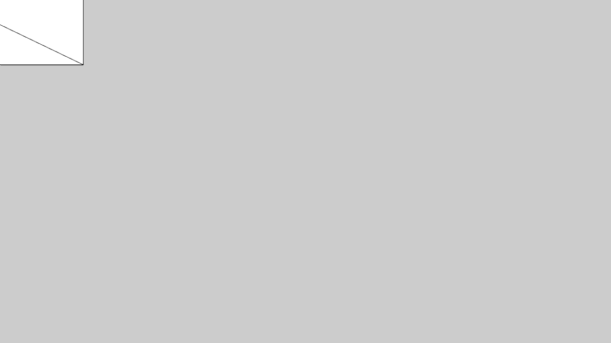

---

# ステップ3：`translate()`で原点を移動

- `translate ()`で原点をキャンバスの左上から中央に移動する
- 3次元になったので引数は３つ：`(x,y,z)`

```processing
void setup(){
  size(1280, 720, P3D);
}

void draw(){
  translate(width/2, height/2, 0);
  box(200);
}
```

---

# ステップ3：`translate()`で原点を移動

真正面なので**立方体**が正方形に見えます

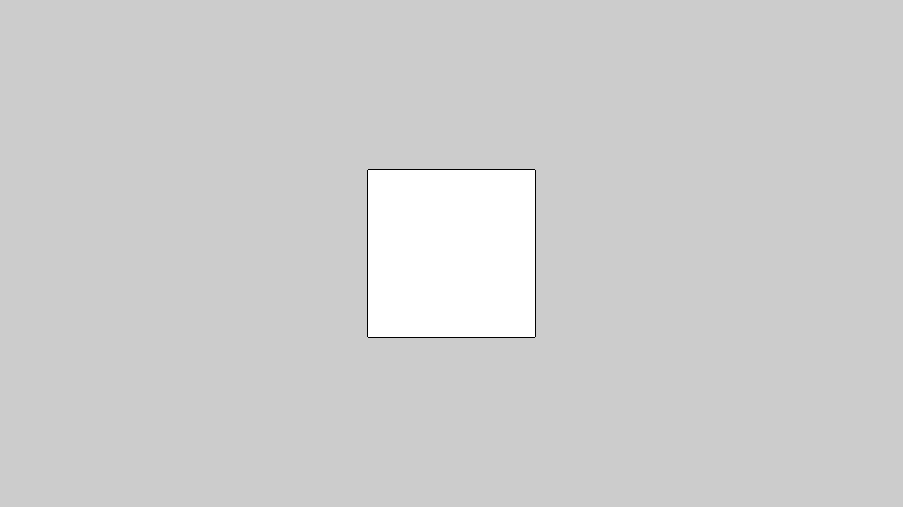

---

# ステップ4：`rotate()`で回転を加える

- 3次元になると回転させる軸を指定する必要がある
- `roateX(),rotateY(),rotateZ()`


```processing
float angle = 0; // 回転角
// void setup(){} 省略
void draw() {
  background(12); // 背景色を設定
  translate(width/2, height/2, 0);

  rotateX(angle);       // X軸方向にangleだけ回転
  rotateY(angle * 0.8); // Y軸方向にangle x 0.8 だけ回転

  box(200);
  angle += 0.01; // angleを微増してゆっくり回転させる
}
```

---

# ステップ4：`rotate()`で回転を加える

これで3次元ぽくなった

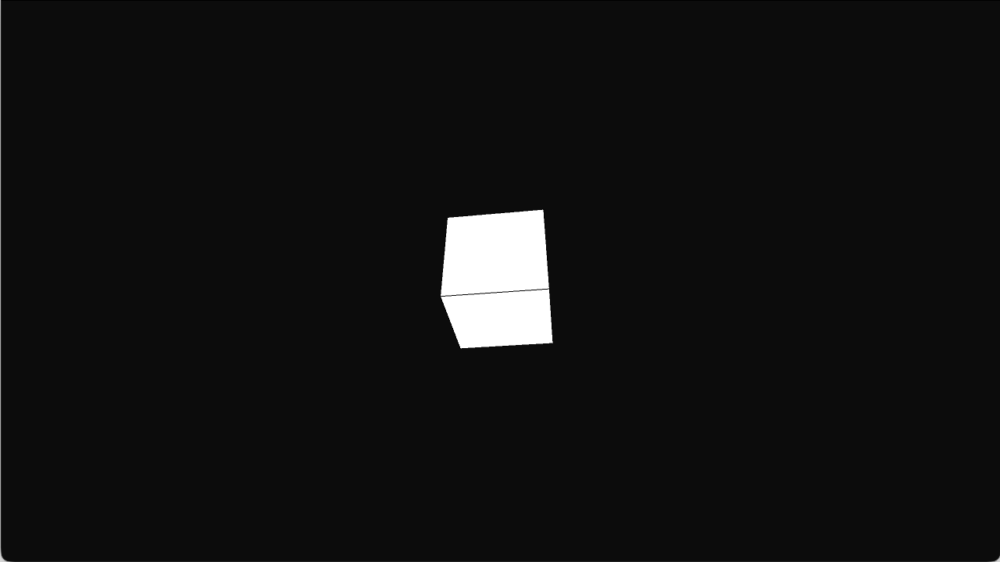

---

# ステップ5：`mouseDragged()`でマウス操作

- `mouseDragged()`：マウスボタンを押したまま動かしたときに実行

```processing
float angX, angY; // 回転角（X軸用とY軸用）
// void setup(){} 省略
void draw() {
  // 省略
  rotateX(angX);  // rotateXにはangXを設定
  rotateY(angY);  // rotateYにはangYを設定
}

void mouseDragged() {
  angX -= (mouseY - pmouseY) * 0.01; // 左右移動で水平回転
  angY += (mouseX - pmouseX) * 0.01; // 上下移動で上下回転
}
```

---

# ステップ5：`mouseDragged()`でマウス操作

マウスドラッグしている間立方体が回転する

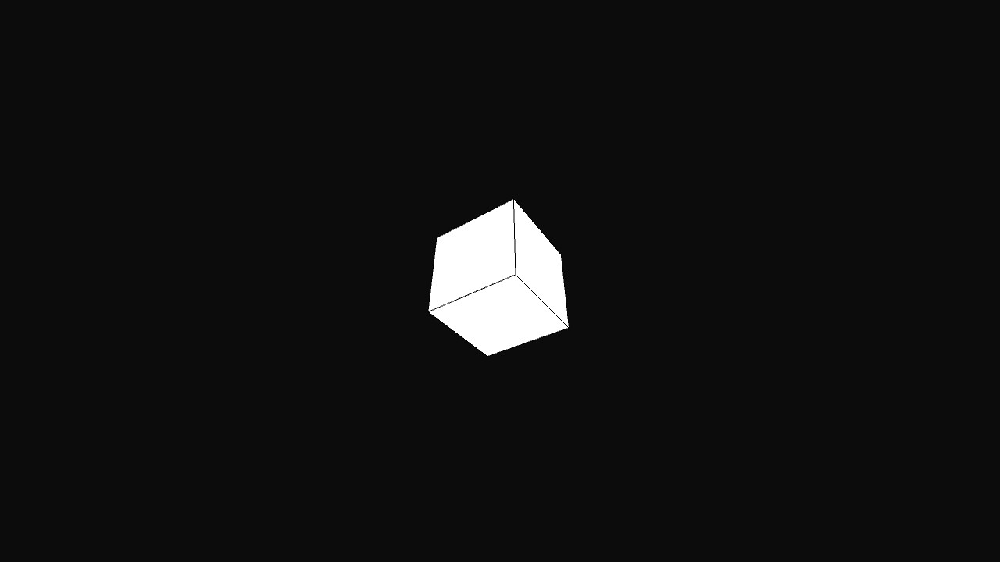

---

# ステップ6：`drawAxes()`を作成して軸の追加

- `drawAxes()`を作成して軸線を描画する

```processing
void drawAxes(float s) { // s:軸線の長さ
  strokeWeight(6);
  stroke(255, 60, 60);
  line(0, 0, 0, s, 0, 0);   // +X（赤）
  stroke(60, 255, 60);
  line(0, 0, 0, 0, s, 0);   // +Y（緑）
  stroke(60, 120, 255);
  line(0, 0, 0, 0, 0, s);   // +Z（青）
}
```

---

# ステップ6：`drawAxes()`を作成して軸の追加

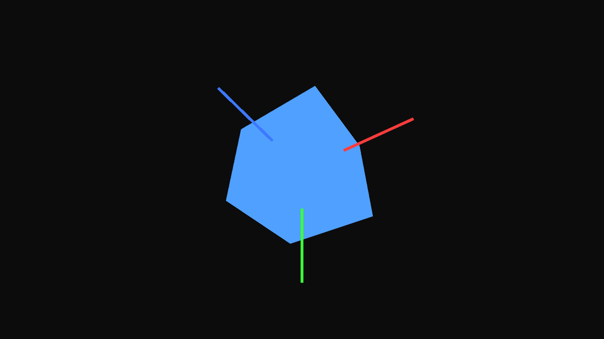

---

# ステップ7：Z軸の移動を追加

- キー入力でZ軸の移動を追加する

```processing
float angX, angY; // 回転角（X軸用とY軸用）
float distZ = -400; // Z軸へ引く（手前が+Z, 奥が-Z）

void draw(){
  background(12);
  translate(width/2, height/2, 0); // 原点を画面中央へ
  translate(0, 0, distZ);          // Z軸方向への移動
}

void keyPressed(){
  if(key=='w') distZ += 20; // 近づく（Zを0に近づける）
  if(key=='s') distZ -= 20; // 遠ざかる（より負に）
}
```

---

# ステップ7：Z軸の移動を追加

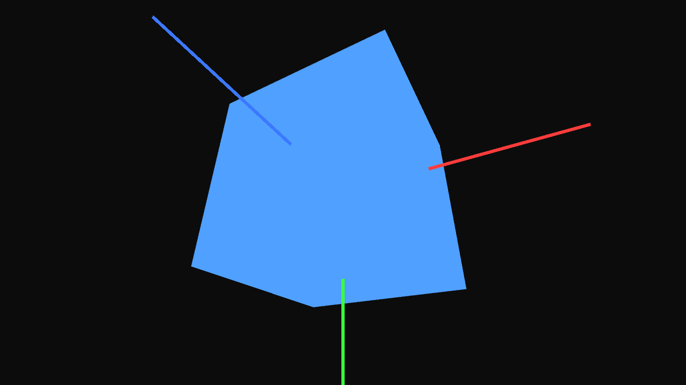

---

# ライティングの基本

- **環境光**：`ambientLight(r,g,b)`（全体を持ち上げる）
- **平行光**：`directionalLight(r,g,b, nx,ny,nz)`（一定方向）
- **点光源**：`pointLight(r,g,b, x,y,z)`（位置から放射）
- **材質**：`specular(r,g,b)`（ハイライト色）, `shininess(v)`（鋭さ）

わかりやすく解説しているサイト
https://tomoto335.hatenablog.com/entry/processing-3dcg-lighting

---

<!-- _class: no-footer -->

# ライティングの基本（光の種類）

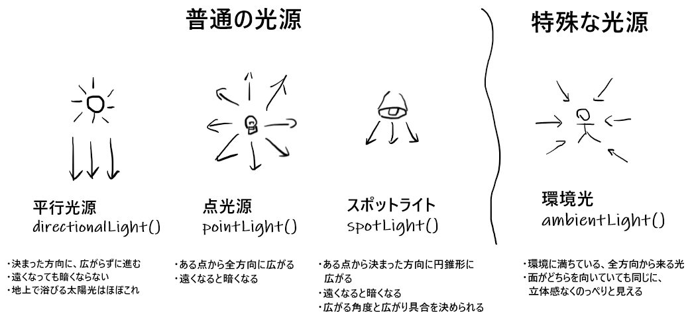


<div style="font-size: 18px;">画像元：<a href="https://tomoto335.hatenablog.com/entry/processing-3dcg-lighting">https://tomoto335.hatenablog.com/entry/processing-3dcg-lighting</a></div>

---

# ライティングの基本

```processing
void draw(){
  background(12);

  ambientLight(32,32,32); // 環境光RGBの値
  directionalLight(220,220,220, -1,-1,-1); // 平行光RGB,光の方向

  translate(width/2, height/2, 0); translate(0, 0, distZ);
  rotateX(angX); rotateY(angY);

  noStroke();
  fill(120,140,220);  // 拡散色
  specular(255);      // 鏡面色
  shininess(40);      // 鋭さ

  box(200);
  drawAxes(240);
}
```

---

# ライティングの基本

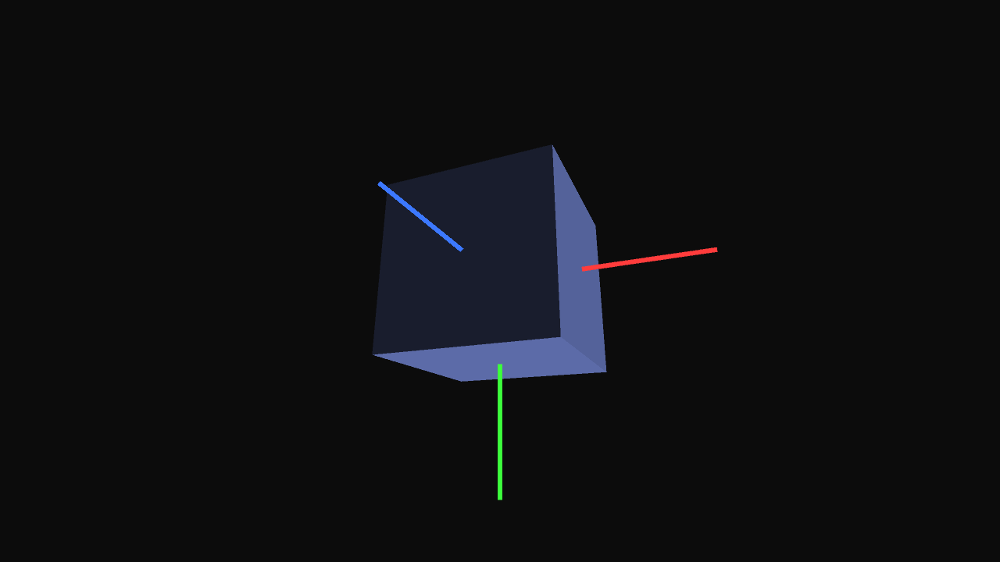

---

# 点光源を動かす（ライトだけ動かす）

```processing
float t;
void draw(){
  background(10);

  ambientLight(24,24,24);
  t += 0.02;
  float lx = 300*cos(t), lz = 300*sin(t);
  pointLight(255,255,255, lx, 120, lz);

  translate(width/2, height/2, 0);
  translate(0, 0, distZ);
  rotateX(angX); rotateY(angY);

  noStroke(); specular(255); shininess(60);
  fill(200); sphereDetail(56); sphere(150);
}
```

---

# 点光源を動かす（ライトだけ動かす）

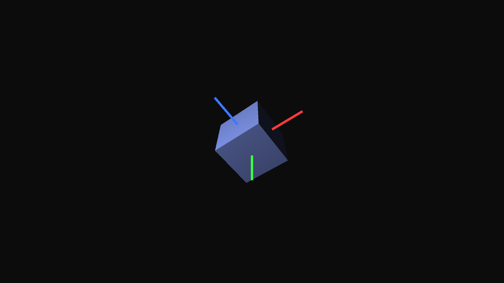

---

# 球にテクスチャを貼る

```processing
PImage earthImg;
PShape globe;

void setup() {
  size(1280, 720, P3D);
  earthImg = loadImage("earth.png");    // data/ に配置
  globe = createShape(SPHERE, 160);
  globe.setTexture(earthImg);
  globe.setStroke(false);
}

void draw() {
  background(10);
  translate(width/2, height/2, 0);
  shape(globe);
}
```

---

# 球にテクスチャを貼る

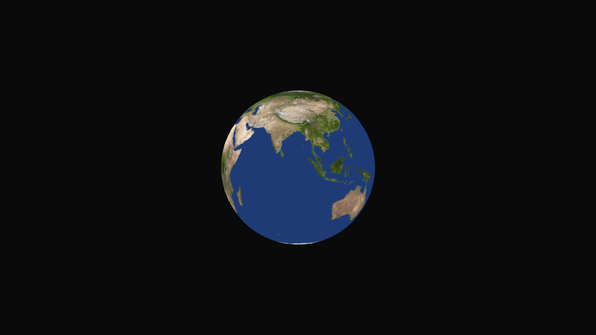

---

# 課題（第3回の提出物）

**テーマ：テクスチャ地球のデモ**

* **必須要件**

  1. `createShape(SPHERE)+setTexture` で地球テクスチャ
  2. **自転**（物体の `rotateY`）と **ライト移動**（点光 or 平行光）
  3. `README.md`（実行/操作/環境）＋ **30–60秒動画**
* **加点要素**：雲レイヤ／UI（キーで自転速度・ライト色）／`saveFrame` でスクショ

---

# 課題（第3回の提出物）

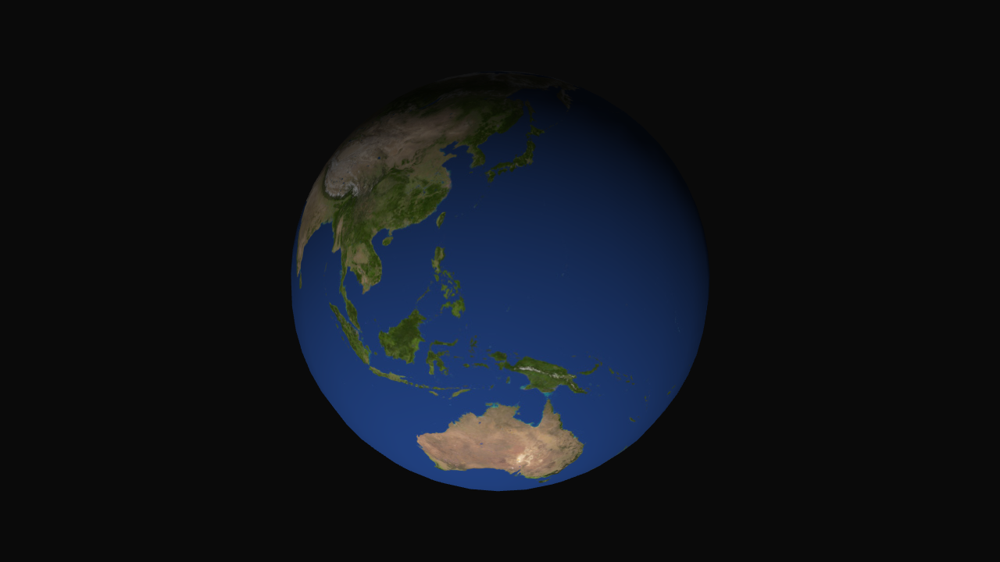

---

# 提出・締切

* 提出先：[Moodle](https://moodle2025.shonan-it.ac.jp/mod/assign/view.php?id=38004)
* 提出物：Processingファイル（xxxxx.pde），実行動画
* 締切：**10月13日(月) 21:00**（厳守）
* 
---

## トラブルシューティング

* **真っ黒**：`ambientLight` を増やす／`fill` が黒でないか
* **ハイライト無し**：`specular()` と `shininess()` を設定
* **テクスチャ貼れない**：`data/` に画像／ファイル名・拡張子
* **奥行き感が弱い**：少し**回す**、`sphereDetail(≥48)`、ライト方向を斜めに
* **重い**：`smooth(4)`／ウィンドウを小さく／`sphereDetail` を下げる
