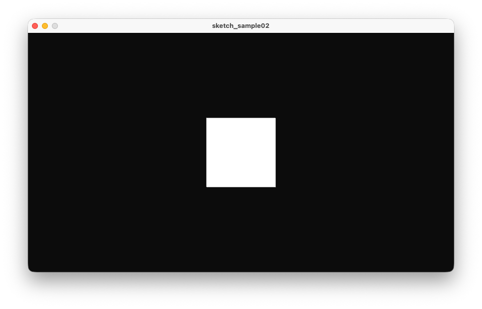

# 情報処理応用基礎
# 第3回：陰影（ライト）とテクスチャ（3D）

清水 哲也 ( shimizu@info.shonan-it.ac.jp )

---

# 第3回 陰影（ライト）とテクスチャ（3D）

## 目的
- ProcessingのP3Dで3D描画
- 基本ライト（ambient/directional/point）
- 材質（specular/shininess）
- テクスチャ貼付（球体）

---

# 授業内容
- 前回復習／今日の到達目標
- P3Dと座標系，カメラ・投影，ライトと材質
- 3Dスターター（軸＋オービット）
- ライトの効果確認（環境光・平行光・点光源）
- テクスチャ球（地球）＋自転
- 課題の要件・提出方法確認

---

# 講義メモ（要点）
- P3Dレンダラ：`size(w,h,P3D)`
- 座標系：右手系（+X 右, +Y 下, +Z 手前）
- カメラ：`camera(ex,ey,ez, cx,cy,cz, ux,uy,uz)`
- 投影：`perspective(fovy, aspect, near, far)／ortho()`（平行投影）
- ライト：`ambientLight`（全体持ち上げ），`directionalLight`（方向一定），`pointLight`（位置から放射）
- 材質：`specular(r,g,b)`, `shininess(v)`（ハイライトの鋭さ）
- テクスチャ：`PImage`→`PShape（createShape(SPHERE, r); setTexture(img)）`

---

# 座標系

グラフィックソフトやゲームエンジンなどで座標系が異なる
- Unity:左手系，Y-up
- UnrealEngine：左手系，Z-up
- Blender：右手系，Z-up
- Maya：右手系，Y-up
- Processing：左手系，Y-up(?)

---

# Step 1：2D最小テンプレ（確認）

```processing
void setup(){
  size(854, 480);   // まずは2D（P3Dなし）
}
void draw(){
  background(245);
  ellipse(mouseX, mouseY, 60, 60);
}
```

**ポイント**：`setup()` は1回，`draw()` は毎フレーム，状態（`fill/stroke`）は**上書き型**

---

# Step 2：P3Dに切り替える（3D起動）

```processing
void setup(){
  size(854, 480, P3D);  // ← 3Dレンダラ
}
void draw(){
  background(12);
  translate(width/2, height/2, 0);
  box(120);            // まずは描けることを確認
}
```

**ポイント**：3Dでは奥行き（Z）が有効。まだカメラもライトも未設定

---

# Step 2：P3Dに切り替える（3D起動）



---

# Step 3：座標軸を描く（空間の把握）

```processing
void draw(){
  background(12);
  drawAxes(200);       // 自前の座標軸関数
}
void drawAxes(float s){
  strokeWeight(3);
  stroke(255,60,60);  line(0,0,0, s,0,0);   // X（赤）
  stroke(60,255,60);  line(0,0,0, 0,s,0);   // Y（緑）
  stroke(60,120,255); line(0,0,0, 0,0,s);   // Z（青）
}
```

**ポイント**：Processingは**右手系**（+X右、+Y下、+Z手前）。軸を常に出すと迷子防止。

---

## Step 4：カメラを設定する（原点を見る）

```java
float camR=480, theta=PI/4, phi=PI/3;
void draw(){
  background(12);
  float ex = camR*sin(phi)*cos(theta);
  float ey = camR*cos(phi);
  float ez = camR*sin(phi)*sin(theta);
  camera(ex,ey,ez, 0,0,0, 0,1,0);   // 視点→原点、上方向Y
  drawAxes(240);
}
void mouseDragged(){
  theta += (mouseX-pmouseX)*0.01;
  phi   -= (mouseY-pmouseY)*0.01;
  phi = constrain(phi, 0.05, PI-0.05);
}
void keyPressed(){ if(key=='w') camR-=20; if(key=='s') camR+=20; camR=constrain(camR,120,2000);}
```

**ポイント**：球座標で簡易オービット。`camera(eye, center, up)` の3ベクトルを理解。

---

## Step 5：投影（透視／平行）を切り替える

```java
boolean useOrtho = false;
void draw(){
  background(12);
  // ... cameraはStep 4のまま
  if(useOrtho) ortho();
  else         perspective(radians(60), (float)width/height, 1, 5000);
  drawAxes(240);
  pushMatrix(); translate(0,0,0); box(100); popMatrix();
}
void keyPressed(){
  if(key=='o') useOrtho = !useOrtho;  // 透視⇄平行の切替
}
```

**ポイント**：遠近感が強すぎる→`fovy` を小さく。Zファイティング→`near` を遠ざける。

---

## Step 6：変換の順序と `push/pop`

```java
void draw(){
  background(12);
  // camera / projection は既存のまま
  drawAxes(240);

  pushMatrix();                // 親のローカル座標
  translate(-150, 0, 0);
  rotateY(frameCount*0.02);
  box(80);
  popMatrix();

  pushMatrix();                // もう一つ（兄弟）
  translate(150, 0, 0);
  rotateX(frameCount*0.02);
  box(80);
  popMatrix();
}
```

**ポイント**：`translate → rotate → scale` の順序で結果が変わる。オブジェクトごとに `push/pop`。

---

## Step 7：階層変換（親子関係）

```java
void draw(){
  background(10);
  // camera / projection は既存のまま
  drawAxes(240);

  // 太陽（親）
  pushMatrix();
  noStroke(); fill(255,180,60);
  sphere(40);

  // 地球（子：親に対する相対変換）
  rotateY(frameCount*0.01);
  translate(200,0,0);
  pushMatrix(); fill(80,160,255); sphere(20);

    // 月（孫）
    rotateY(frameCount*0.03);
    translate(60,0,0); fill(220); sphere(8);
  popMatrix();
  popMatrix();
}
```

**ポイント**：**親に対する相対**で動く。モデル行列を積んでいくイメージ。

---

## Step 8：ライト（環境光＋平行光）

```java
void draw(){
  background(10);
  // camera / projection は既存のまま
  ambientLight(32,32,32);                    // 全体の持ち上げ
  directionalLight(220,220,220, -1,-1,-1);   // 太陽光
  noStroke(); specular(255); shininess(40);
  // 物体たちを描画（Step 6/7 のシーンなど）
}
```

**ポイント**：真っ黒問題は**ライト不足**が原因なことが多い。`specular/shininess` でハイライト。

---

## Step 9：点光源を動かす（見えの変化）

```java
float t;
void draw(){
  background(8); t += 0.02;
  ambientLight(24,24,24);
  float lx = 400*cos(t), lz = 400*sin(t);
  pointLight(255,255,255, lx, 200, lz);  // 点光源が周回
  // 目印
  pushMatrix(); translate(lx,200,lz); emissive(255,220,180); sphere(6); popMatrix();
  // オブジェクト
  specular(255); shininess(50); fill(200); sphereDetail(48); sphere(140);
}
```

**ポイント**：距離減衰は固定的（古典パイプライン相当）。強すぎるときは色を落とす。

---

## Step 10：材質（マテリアル）の直感調整

```java
void draw(){
  // ... ライト設定後
  specular(255,255,255);    // 鏡面の色（白いハイライト）
  shininess(10);            // 小→広く柔らかい
  // shininess(80);         // 大→鋭い
  fill(80,160,255);         // 拡散色（ベースカラー）
  sphere(120);
}
```

**ポイント**：`fill` と `specular` は別。`shininess` は「ハイライトの鋭さ」。

---

## Step 11：テクスチャを球に貼る（PShape）

```java
PImage earthImg; PShape globe; float ry;
void setup(){
  size(1280,720,P3D); smooth(8);
  earthImg = loadImage("earth.jpg");   // data/ に配置
  globe = createShape(SPHERE, 160);
  globe.setTexture(earthImg);
  globe.setStroke(false);
  sphereDetail(64);
}
void draw(){
  background(10);
  // camera / projection / light は既存
  pushMatrix();
  rotateY(ry); ry += 0.01; // 自転
  shape(globe);
  popMatrix();
}
```

**ポイント**：`sphere()` へ直接 `texture()` は不可。**`PShape(SPHERE)`＋`setTexture`** が簡便。

---

## Step 12（任意）：雲レイヤ＆簡易大気

```java
PImage clouds; PShape cloudLayer;
void setup(){
  // ... globe 生成後
  clouds = loadImage("clouds.png"); // 透過PNG
  cloudLayer = createShape(SPHERE, 163);
  cloudLayer.setTexture(clouds);
  cloudLayer.setStroke(false);
}
void draw(){
  // ... 地球の描画後
  pushMatrix();
  rotateY(-ry*1.2);  // 相対的にずらす
  tint(255, 220);    // うっすら
  shape(cloudLayer);
  noTint();
  popMatrix();
}
```

**ポイント**：`tint()` は描画直前のみ有効。終わったら `noTint()`。

---

## Step 13：便利機能（保存・解像度・ディテール）

* `saveFrame("shot-####.png")`：連番スクショ。
* `pixelDensity(displayDensity())`：高DPIでのにじみ対策。
* `sphereDetail(n)`：球メッシュの分割数（**品質と負荷**のトレードオフ）。

---

## Step 14：トラブル対処（チェックリスト）

* **真っ黒**：`ambientLight` を増やす／`fill` が黒でないか。
* **ハイライト無し**：`specular()` と `shininess()` を設定。
* **テクスチャ不可**：`data/` に画像／ファイル名・拡張子。
* **カメラが裏返る**：`up(0,1,0)` を維持／`phi` の範囲を制限。
* **Zが破綻**：`perspective` の `near` を遠く、`far` を近く。

---

## Step 15：小課題（チェックアウト）

1. `o` キーで **透視⇄平行** を切替、違いをスクショ2枚で説明。
2. 点光源の高さ（Y）を `sin` で上下させ、**見え方の変化**を1文で記述。
3. 地球テクスチャに**雲レイヤ**を重ね、`tint` の値を2種試す（220 と 160）。

---

## 付録：用語の最短定義

* **カメラ（View変換）**：世界座標→カメラ座標の変換（視点・注視点・上方向）。
* **投影（Projection）**：3D→2Dへの写像（透視／平行）。
* **モデル変換（Model）**：物体のローカル座標→世界座標へ。親子関係は**相対変換の積**。
* **材質**：拡散色（`fill`）／鏡面（`specular`）／鋭さ（`shininess`）。
