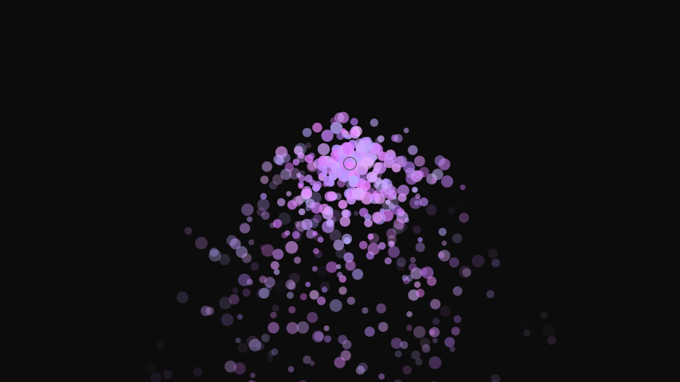
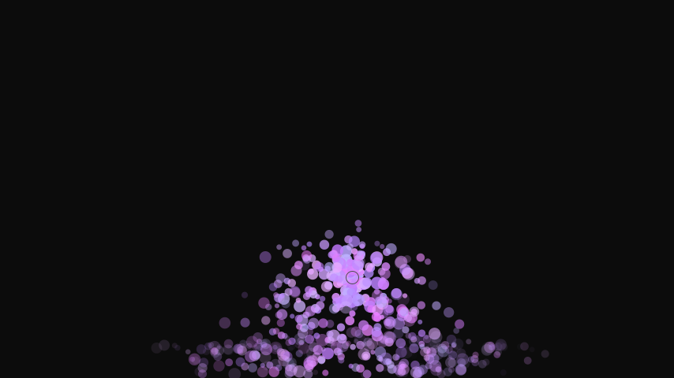

# 情報処理応用基礎
# 第3回：アニメーション／ベクトル／粒子

清水 哲也 ( shimizu@info.shonan-it.ac.jp )

---

# 目的

- 時間更新
- PVector
- 粒子システムの基本を身につけ、入門的な物理表現（重力・反発・減衰）を実装できるようにする

---

# 今日のゴール
- `frameCount/millis()` と時間更新（`Δt` (`Δ`=デルタ)） の考え方を説明できる
- `PVector` を用いた `pos` / `vel` / `acc` の更新が書ける
- 粒子クラスとエミッタを自作し，寿命・フェード・重力・反発を実装できる

---

# 前回の復習（要点）
- `size(..., P3D)` / `translate` / `rotate` で3Dの見え方を体験
- ライト（`ambient` / `directional` / `point`）
- 材質（`specular` / `shininess`）
- `PShape(SPHERE).setTexture(img)` で球にテクスチャ

---

# アニメーションの最小原則
- 毎フレーム：状態を更新 → 画面を描く
- 状態：位置 `x`,`y`, 速度 `vx`,`vy`,（必要なら加速度 `ax`,`ay`）
- 壁反射：画面端に当たったら速度の符号を反転

```processing
float x=200, y=200, vx=3, vy=2;
void setup(){ size(854,480); }
void draw(){
  background(245);
  x += vx; y += vy;               // 位置更新
  if(x<15 || x>width-15)  vx *= -1; // 反射
  if(y<15 || y>height-15) vy *= -1;
  noStroke(); fill(40,120,220);
  ellipse(x, y, 30, 30);
}
```

---

# アニメーションの最小原則


---

# Δt（デルタタイム）で滑らかに


フレーム依存をなくして“同じ速さ”を保つ
- 目的：PCごとのフレーム間隔の違いに影響されず、一定の速度/挙動を実現する
- 式：`Δt = (millis()_now - millis()_prev) / 1000.0` （秒）
- 実装方針：状態更新は`物理単位（px/秒 等）× 経過時間`（秒）
- `millis()`：スケッチの開始からの経過時間（ミリ秒単位、1000分の1秒）を返す

---

# なぜ必要？（フレーム依存の問題）
- 「毎フレーム x += 3;」はFPSが高いほど速くなる
- 例：60FPS → 1秒で 3×60 = 180px、30FPS → 1秒で 90px
- 対策：フレームではなく時間にもとづいて移動量を計算
- Unityの`Update()`と`FixedUpdate()`の違いに近い

---

# なぜ必要？（フレーム依存の問題）


### フレーム依存（よくない例）
```processing
float x=0; void draw(){ x += 3; }
```

### 時間依存（Δt導入）
```processing
int pm = 0;
float x=0, vx=180; // 180px/秒
void setup(){ size(854,480); pm = millis(); }
void draw(){
  int now = millis();
  float dt = (now - pm) / 1000.0; pm = now; // 秒
  x += vx * dt; // 1秒で 180px 進む（FPSに無関係）
}
```

---

# Δt の正体と単位
- `millis()`：起動からの経過ミリ秒（int）
- `dt（秒） = (now - pm) / 1000.0`
- 速度 `vx` は `px/秒`、加速度 `ax` は `px/秒^2` に統一
- 更新式：（オイラー法）
- `vel += acc * dt`
- `pos += vel * dt`

---

# Δt（デルタタイム）で滑らかに

```processing
int pm; // 前フレームの millis
float x=200, vx=200; // 速度は「px/秒」
void setup(){ size(854,480); pm = millis(); }
void draw(){
  int now = millis();
  float dt = (now - pm) / 1000.0;
  pm = now;
  background(245);
  x += vx * dt;                 // 秒あたり速度 × 経過秒
  if(x<15 || x>width-15) vx*=-1;
  ellipse(x, height*0.5, 30,30);
}
```

---

# Δt（デルタタイム）で滑らかに


---

# `PVector` 入門：`pos` / `vel` / `acc`（前半）
- `PVector` は 2D/3D ベクトル．加算・スカラー倍・正規化などが便利
- 運動の基本：`vel.add(acc); pos.add(vel); acc.mult(0);`

```processing
PVector pos, vel, acc, gravity;
int pm;
void setup(){
  size(854,480);
  pm = millis();
  pos = new PVector(0, 80); // 初期位置
  vel = new PVector(40, 0); // 初期速度
  acc = new PVector(); // 加速度
  gravity = new PVector(0, 800); // px/秒^2
}
```

---

# `PVector` 入門：`pos` / `vel` / `acc`(後半)

```processing
void draw(){
  float dt = (millis()-pm)/1000.0; pm = millis();
  background(250);
  // 力（ここでは重力）を加速度へ
  acc.add(PVector.mult(gravity, dt));
  // 速度・位置の更新
  vel.add(PVector.mult(acc, dt));
  pos.add(PVector.mult(vel, dt));
  acc.mult(0);
  // 床との反発（反発係数）
  float r=15;
  if(pos.y>height-r){ pos.y=height-r; vel.y = -abs(vel.y)*0.7; }
  // 表示
  noStroke(); fill(20,120,220);
  ellipse(pos.x, pos.y, r*2, r*2);
}
```

---

# `PVector` 入門：`pos` / `vel` / `acc`


---

# 粒子クラスを作る（寿命とフェード）(前半)

```processing
class Particle{
  PVector pos, vel;
  float life;
  color col;
  float r;
  Particle(PVector origin){
    pos = origin.copy();
    vel = PVector.random2D().mult(random(80, 240)); // px/秒
    life = 1.0;                   // 1.0→0.0 で減衰
    r = random(3,8);
    col = color(random(180,240), random(120,180), 255);
  }
  // つづく
```

---

# 粒子クラスを作る（寿命とフェード）(後半)

```processing
  // つづき
  void update(float dt){
    // 重力＋減衰
    vel.y += 400*dt;
    pos.add(PVector.mult(vel, dt));
    life -= 0.8*dt;               // 約1.25秒で消える
  }
  void draw(){
    float a = constrain(life, 0, 1);
    noStroke(); 
    fill(col, 255*a);
    ellipse(pos.x, pos.y, r*2, r*2);
  }
  boolean dead(){
    return life<=0;
  }
}
```

---

<!-- _class: no-footer -->

# エミッタで粒子を管理する

- **エミッタ**：粒子を発生させる"**発生源**"

```processing
ArrayList<Particle> ps = new ArrayList<>();
PVector emitter;
int pm;
void setup(){ size(854,480); emitter = new PVector(width/2, height-60); pm = millis(); }
void draw(){
  float dt = (millis()-pm)/1000.0; pm = millis();
  background(12);
  // 毎フレーム数個ずつ放出
  for(int i=0;i<8;i++) ps.add(new Particle(emitter));
  // 更新＆描画（後ろから消す）
  for(int i=ps.size()-1; i>=0; i--){
    Particle p = ps.get(i);
    p.update(dt); p.draw();
    if(p.dead()) ps.remove(i);
  }
  // エミッタの目印
  stroke(80); noFill(); ellipse(emitter.x, emitter.y, 16,16);
}
void mouseMoved(){ emitter.set(mouseX, mouseY); } // 移動可能
```

---

# 粒子クラスを作りエミッタで粒子を管理する



---

# 応用：床反発・摩擦・天井制限
- 反発：`vy = -abs(vy) * 反発係数`
- 摩擦：`vel.mult(0.98);`（床接触時）
- 上限：`vel.limit(maxSpeed);`

```processing
// Particle.update 内に追加例
if(pos.y>height-5){
  pos.y=height-5;
  vel.y = -abs(vel.y)*0.6;
  vel.mult(0.9);
  }
vel.limit(600);
```

---

# 応用：床反発・摩擦・天井制限



---

# パフォーマンスのコツ
- 粒子数を絞る：まずは 200〜1000 程度で 60FPS を目標
- 生成の再利用：必要に応じて プール（使い回し）を検討
- `noStroke()` やウィンドウ縮小、描画分解能（半径/個数）で負荷調整
- リスト削除は後ろから（または `removeIf`）

---

# 課題：粒子噴水（提出物）
- 必須要件
  1. エミッタから粒子を連続放出（1フレームあたり 5 個以上）
	2. 重力と床反発（減衰あり）を実装
	3. 寿命とフェード（透明度 or サイズ）
	4. 200 粒子以上で 滑らかに動作（FPS 目安）
	5. 実行時の動画

---

# トラブルシューティング
- 重い：粒子数/半径を減らす，`noStroke()`，ウィンドウ縮小
- 消えない：`life`の減らし方を確認，削除は後ろから
- 跳ねすぎ：反発係数を `0.5〜0.8` に，`vel.limit()` を併用
- カクつく：`Δt` を導入，または `frameRate(60)` の確認

---

# 付録：よく使う PVector API
- `PVector.add/sub/mult/div`（加減乗除）
- `PVector.normalize()`（長さを1に）
- `PVector.limit(max)`（速度上限）
- `PVector.random2D()`（ランダム方向）
- `PVector.dist(a,b), PVector.dot(a,b)`